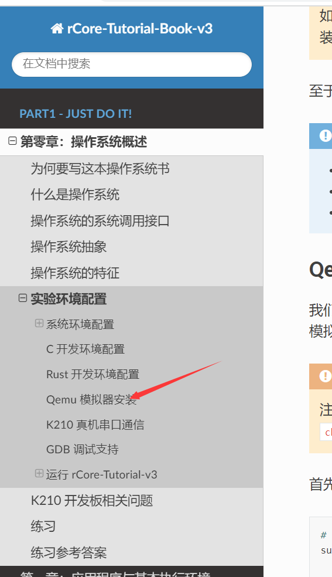
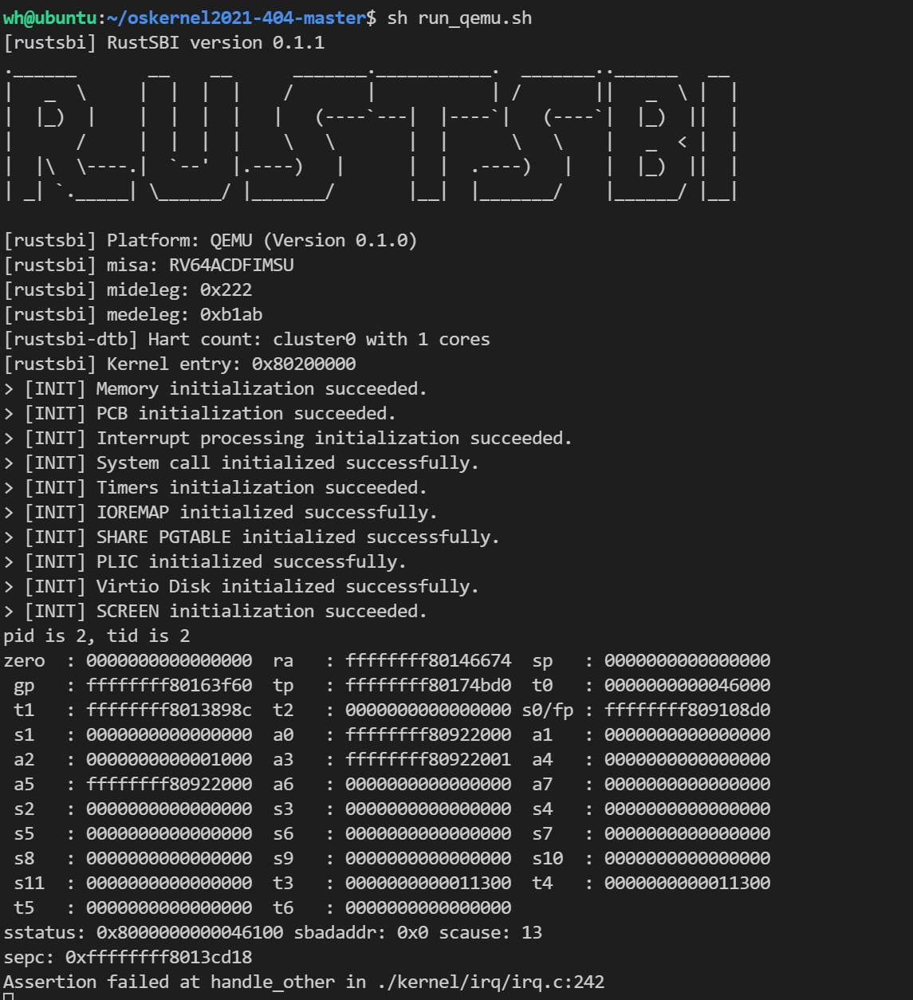

# 准备工作

## RISCV编译工具安装

首先需要安装riscv工具链，即

`riscv64-unknown-elf-gcc`

根据学长提供了信息，在初赛时用官方编译工具没有问题，但是决赛时出现了编译差别，因此最好使用比赛方提供的[k210交叉编译器](https://github.com/oscomp/testsuits-for-oskernel/blob/master/riscv-syscalls-testing/res/kendryte-toolchain-ubuntu-amd64-8.2.0-20190409.tar.xz)，直接将bin加入linux环境变量中即可(这样就不需要下载了)

## QEMU安装

这次实验使用的k210平台和华中科技大学的实验课基本是一样的，这是他们任务书的网址：

https://rcore-os.github.io/rCore-Tutorial-Book-v3/

大致看了下，实验书中说qemu-5.0.0应该是最适合的，按照实验书中说明，安装步骤在这里(在上述任务书中)：

PS：现在学长的代码我没有运行成功，具体现象为进到了0地址产生了无法处理的例外，按照学长的说法，QEMU有很多问题没有解决，所以当时是直接上板的，现象如下：

