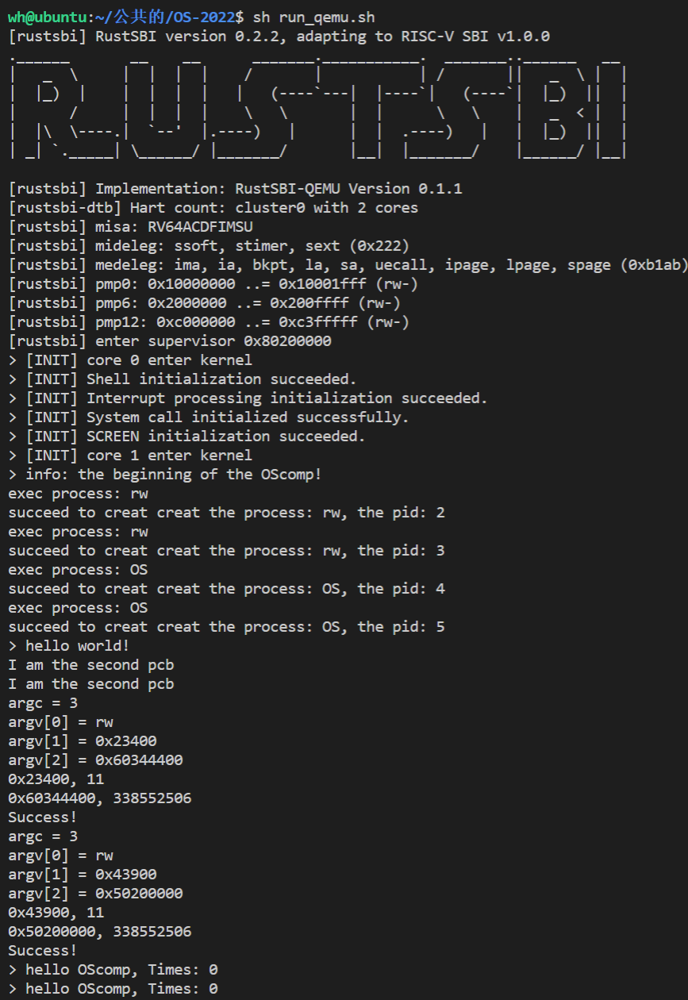

# 简单的双核系统

暂时完成了一个支持简单的进程调度，内存管理的操作系统

## 双核说明：

### 核ID

某些功能的实现必须需要核ID的辅助，因此将核ID号存放在每个核的tp寄存器当中，在恢复上下文时借助sscratch寄存器操作（这里坑很多，比如gp寄存器的问题），为了实现例外处理，首先需要拿到当前核运行的pcb结构体的地址，随后再进行保存和回复上下文的操作。完成操作后再释放回来。

### 细粒度的锁

目前实现了自旋锁和互斥锁，自旋锁的实现在文件`kernel/smp/spinlock.c`当中，其中acquire为加锁操作，release为解锁操作，可以方便的使用如下宏定义：

```C
spinlock_init(time_lock);
```

在需要锁的地方初始化一把锁

在所有的内核操作中，只要涉及到共享资源，都需要注意锁的问题，目前没有考虑性能的问题，在需要使用到锁的地方，基本都使用了自旋锁

互斥锁实现在文件`kernel/locking/lock.c`当中，原理类似。

<!--共享资源访问不加锁可能会出现很多问题，后期的文件系统设计需要注意这个问题！-->

## 屏幕缓冲区实现

重新编写了一个环形缓冲区，文件位于`drivers/screen/`当中，原先的屏幕缓冲区函数并没有删除仍然位于目录drivers下，目前看来，屏幕打印函数仅仅只是自己测试时使用，初赛当中应该不会使用屏幕缓冲区输出（初赛应该是输出到SD卡当中的某个文件当中），注意缓冲区的使用需要加锁。

## 样例说明

在test当中包含了三个测试样例，测试的方法与OSlab一样，其中`rw.c`是用于测试缺页中断的，测试成功显示Success，`OS.c`文件循环打印输出。在shell.c中：

```c
  // TODO:

  sys_screen_clear();

  printf("> info: the beginning of the OScomp!\n");
  do_command("exec rw 0x43900 0x50200000", 27);
  do_command("exec rw 0x23400 0x60344400", 27);

  shell_exec("OS",0 ,0 ,0, 0, 0);
  shell_exec("OS",0 ,0 ,0, 0, 0);

  for(int i = 0; ; i++){
​    printf("> hello world!\n");
​    sys_sleep(2);
  }
```

所有的进程都不会退出。

## 缺页中断说明

qemu当中缺页中断与OSlab一致，在k210当中的相应中断号也和OSlab一致，不过处理方式有所区别，在k210当中当缺页中断后进入例外处理入口后其sstatus中的SPP位被拉高，这表示这这是一个来自于S态的中断，初步猜测应当是SBI处理后从委托给S态处理而改变了sstatus的信息，因此需要手动恢复，按需调页的处理与OSlab是一致的。

## 运行效果图



## 总结

基本的调度已经能够顺利进行（支持命令行参数），接下来可以一边进行系统调用的实现工作一边进行SD卡驱动和文件系统的实现。