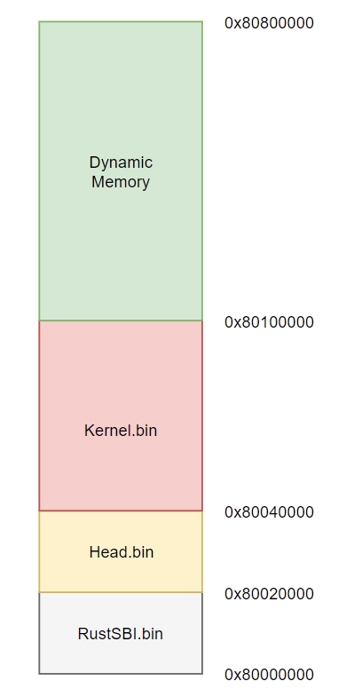
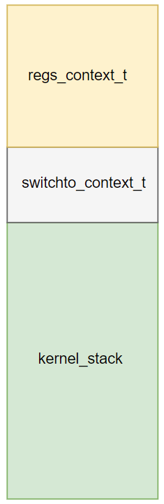
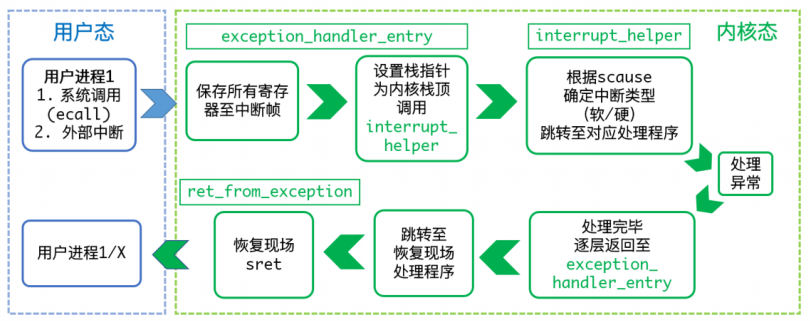
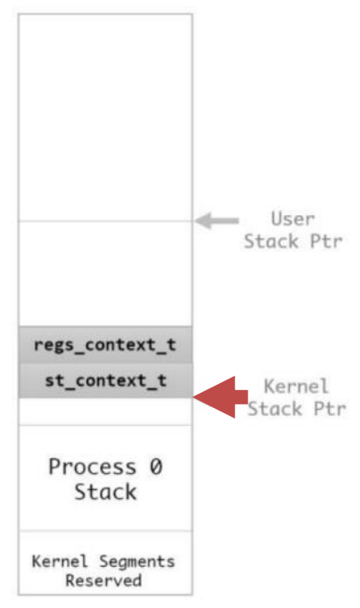

[TOC]

# 操作系统内核设计赛设计文档(初赛)

## 成员组成

- 学校：中国科学院大学
- 队名：C-core
- 队员：
  - 王函
  - 裴晓坤
  - 黄天羿

## 概述

本次比赛中，我们小队设计的操作系统基于RISC-V指令集架构，内核的框架使用了中国科学院大学操作系统研讨课课程的代码框架，与oskernel2021-404项目所使用的框架一致，并基于此框架做了很多改进工作。使用了洛佳学长提供的最新版**RustSBI(0.0.2)**，此处非常感谢RustSBI做的兼容性相关的工作，大大方便了内核的开发工作。目标平台为k210开发板，实现了系统初始化、中断和例外、I/O、进程管理、内存管理、文件系统等一系列基本功能并通过了初赛的各项测试，下面我们将在设计实现当中进行详细的说明。

## 设计实现

### 内核镜像布局

为了充分利用k210主板上有限的内存，我进行了很多探索，其中一个显然的难点是：

当内核开始加载执行时是运行在物理地址上的，此时还没有打开虚存。当打开虚存之后，内核开始执行在虚拟内存上，需要以何种方式来实现这种转换呢？

为了解决这个问题，我们准备了两种方案：

​	方案一

- 首先将运行在虚拟内存上的内核（**记作A**）编译出来，将其转化为一维数组编译到另一个执行在物理内存上的程序（**记作B**）中，利用objcopy工具将B转化为可以在裸机上执行的二进制镜像文件，这样在裸机上运行B时，首先打开虚存，随后将已经转化为数组的内核A视为elf文件加载到指定的位置，随后跳转到指定入口，这样便完成了内核的加载。

​	方案二

- 直接编译两个程序（**记作A和B**），利用objcopy工具将它们都转化为能在裸机上执的二进制镜像文件，其中A执行在物理地址上，B（也就是内核）执行在虚拟内存上，通过dd命令将两者合并，加载到指定位置上，其中A的地址低于B的地址，这样rustsbi在完成初始化工作后直接跳转到A程序的入口执行，在完成打开虚存，IO空间映射后直接跳转到内核也就是B程序的镜像所在的空间。

显而易见，较之于方案一，方案二不需要将内核elf文件编译到程序中，其节省了大量的内存空间，这对于k210开发板上的小内存而言，无疑是一种巨大的提升，因此我们采用了方案二，我们根据官方SDK和u-core任务书成功打开了8MB的内存，只需如下操作：

```c
sysctl_pll_enable(SYSCTL_PLL1);
sysctl_clock_enable(SYSCTL_CLOCK_PLL1);
```

于是我们内核镜像结构如下图所示：




​	其大致空间布局如下：

​	0x80000000~0x80020000：该空间供为RustSBI运行的空间

​	0x80020000~0x80040000：进行加载内核之前的准备工作，包括打开8MB内存，打开虚存，IO空间映射。

​	0x80040000~0x80100000：该空间为内核运行的空间

​	0x80010000~0x80800000：该空间为可供内核使用的动态分配的空闲空间

​	当双核已经完全进入到内核代码后，Head.bin的空间就不会再被用到，这里我们可以考虑将其纳入可动态分配的空间当中，并且内核运行的空间也是需要动态的变化的，随着内核体量的主键增加，其所占用的空间会不断的增加，因此内核运行区域的顶部是可以不断变化的。

​	这样，当RustSBI完成初始化工作后直接跳转到Head.bin入口，首先打开8MB内存，进行内核空间二级页表映射，IO空间映射，打开虚存最后进入到Kernel.bin即操作系统内核当中。

### 启动初始化	

#### 双核启动

在双核启动的过程中我们还是遇到了很多麻烦，在这里k210和qemu上存在较大的差别，在qemu上，双核同时上电启动运行代码，因此需要将从核的中断入口设置为内核入口，随即进入循环，待主核完成一些列的初始化工作以后，向从核发送核间中断，于是从核便能跳转到内核入口执行。在k210开发板上，起初只有主核上电成功，当主核向从核发送核间中断后，从核才上电执行，因此其不需要像qemu一样将从核陷入循环，这相对于qemu简单的多，只需上电后执行一系列的工作即可，不需要设置中断入口为内核入口。

由于在S态不可能读取到M态才能读取到的`mhartid`寄存器，并且用内存来存储核ID是不显示的，因为内存对于两个和而言没有本质区别，因此我们将核ID放置在tp寄存器当中，由于我们的上下文全部保存在每个进程的内核栈中，而内核栈和用户栈信息是保存在pcb结构体当中的，因此在每次陷入内核之前我们都需要暂时将tp寄存器中的内容替换为当前核上进程的pcb地址，随后再进行保存上下文和切换上下文的操作。此处需要借助特权寄存器sscratch暂存gp或者tp寄存器的值，一段简单的代码如下：

```assembly
csrw CSR_SSCRATCH, gp
  /* Load the global pointer */  
  .option push
  .option norelax
  la gp, __global_pointer$
  .option pop  
  /* save the tp to the sscratch */
  /* store the pcb to tp */
  /* csrw CSR_SSCRATCH, tp */
  bnez tp, exception_second_kernel
  ld tp, current_running_master
  csrrw gp, CSR_SSCRATCH, gp
  csrwi CSR_SSCRATCH, 0
  j exception_begin

exception_second_kernel:
  ld tp, current_running_slave  
  csrrw gp, CSR_SSCRATCH, gp
  csrwi CSR_SSCRATCH, 1  

exception_begin: 
  SAVE_CONTEXT
```

在内核执行代码时只需要调用`get_current_cpu_id()`以及`get_current_running()`函数就能得到当前运行的核的ID号和当前核上运行的进程的PCB地址。

#### 系统初始化	

​	下面将对主核和从核的工作做简要的说明：

1. **主核**

   - 清空.bss段，在裸机上内存不一定为0，因此需要手动构造C语言运行环境，将内存清零。
   - 设置head.bin运行的栈空间
   - 打开8MB内存，根据官方SDK，在打开8MB内存后，随即向0x80700000随机写入一个数字再读出进行对比，相等则代表成功
   - 内核空间映射，使用 RISC-V 标准的 SV39 内存管理方法，页表格式与 SV39 标准一致，首先在根页表上映射内核空间和IO空间，对于内核空间以及IO空间映射，我们都采取二级页表即2MB的大页映射，按照RISC-V规范，虚拟地址最高位为1为内核使用的空间，否则为用户使用的空间，因此我们的内核起始为0xffffffc080040000，即只需要在物理地址加上0xffffffc000000000，这样可以简单的实现内核对所有内存的管理。用户能够使用的空间即为39位虚地址最高位为0的地址段，并且所有用户态的程序的根页表都需要拷贝内核页表，在此基础上进行用户空间映射，以便陷入内核时能够直接执行内核代码而不需要切换页表而影响性能。
   - 打开虚存机制进入内核
   - 初始化内存管理器，此部分将在内存管理部分详细说明
   - 发送核间中断唤醒从核，并等待从核进入内核
   - 取消在Head.bin中临时建立的直接内存映射，因为在Head,bin是运行在物理地址空间的，在打开虚存后，为了保证能够继续执行，需要将0x80000000到0x80800000的空间临时映射到对应的物理地址，这样才能保证不出错，当从核和主核都进入到内核后，就不会再运行Head.bin的代码，可以直接取消这部分映射
   - 初始化shell，理论上内核的执行必须需要一个用户态的程序来主动加载SD卡中的应用程序，但是测评机中的SD中的内容是固定只有所有的测试程序，因此我们直接将shell编译到内核当中并在进入内核时将其作为第一个用户态程序加载执行。
   - 设置内核频率，这里是由我们自主决定的
   - 初始化SD卡，此处我们参考了官方SDK以及oskernel2021-404的驱动代码。
   - 初始化FAT32文件系统，包括读取文件系统簇以及扇区的信息等等，此处也参考了oskernel2021-404的部分函数实现，并进行优化。
   - 初始化中断，代码实现在`./arch/riscv/trap.S`当中，只需要设置`stvec`寄存器的值为中断入口，打开`stie`寄存器的`stie`即时钟中断位
   - 初始化系统调用表，系统调用表采用长度为512的函数指针数组，初始化函数位于`init/main.c/init_exception`中，部分代码如下：

   ```c
   /* open close */
   syscall[SYS_openat]              = (long int (*)())&fat32_openat;
   syscall[SYS_close]               = (long int (*)())&fat32_close;
   
   /* read */
   syscall[SYS_read]                = (long int (*)())&fat32_read;
   // /* write */
   syscall[SYS_write]               = (long int (*)())&fat32_write;
   ```

   - 初始化屏幕缓冲区，此处采用环形缓冲区实现

2. **从核**

   - 从核被唤醒之后设置好head.bin运行的栈空间后进入到head.bin，直接设置根页表并打开虚存即可
   - 设置从核自身的特权寄存器，设置`stvec`寄存器的值为中断入口，打开`stie`寄存器的`stie`即时钟中断位

当主核和从核完成上述工作后，即可设置时钟中断，为了应对可能存在无进程运行的情况，我们为主核和从核准备了两个内核进程，其只在内核做循环，当无进程可以执行时则分别运行他们，因此需要利用函数`enable_interrupt()`打开其`sstatus`寄存器的`sie`位使得其能在S态接受时钟中断。在我们的设计当中没有实现嵌套中断，即用户态的程序在进入到内核之后其时钟中断被屏蔽。

### 进程与中断

#### 进程管理

与进程管理相关的主要头文件在`include/os/sched.h`当中，主要函数实现在`kernel/sched/sched.c`当中。

进程管理是操作系统中最重要的一部分，其中最重要的数据结构是PCB描述符，其定义在头文件`include/os/sched.h`当中，每一个进程都会有一个进程描述符，其管理着进程执行相关的的重要数据，其中内核栈指针kernel_sp、用户栈指针 user_sp用来保证进程在用户态和内核态之间正确切换而不会发生错误。kernel_stack_top，kernel_stack_base用于存储内核栈栈顶和栈底信息，user_stack_top， user_stack_base用存储用户栈栈顶和栈底信息。list链表用于拉链，used位标记该PCB描述符是否已经被使用，wait_list用于挂载等待该进程结束的进程，以及表示进程状态和id等信息、进程类别，退出状态以及其他一些必要的信息，此处不再赘述，每个进程的内核栈上都保存了必要的进程切换以及上下文信息，内核栈的结构如下：



​	其中reg_context包含了进程调度时需要的32个通用寄存器以及几个必要的特权寄存器的信息：

```C
typedef struct regs_context
{
    /* Saved main processor registers.*/
    reg_t regs[32];

    /* Saved special registers. */
    reg_t sstatus;
    reg_t sepc;
    reg_t sbadaddr;
    reg_t scause;
} regs_context_t;
```

switch_context只包含了必要的进程切换所需要的14个寄存器的信息，需要保持在进程被调度后再次回到内核后执行环境的正确性

```c
typedef struct switchto_context
{
    /* Callee saved registers.*/
    reg_t regs[14];
    // /* satp reg */
    // reg_t satp;
} switchto_context_t;
```

进程管理的初始化在系统初始化时完成，其将所有的PCB设置为未使用，并初始化一些比较重要的数据结构，在双核的情况下，为了尽快的获得当前正在执行的进程的信息，我们设置了两个全局PCB指针变量current_running_master，current_running_salve，分别指向主核和从核当前正在执行进程的PCB，这样便能在进程进入到内核时根据核的ID号拿到正确的PCB指针，当初始化完成一个进程后，便会将其加入到ready_queue队列当中由调度器进行调度，由于目前初赛对效率要求不是很高，因此我们采用了最为简单的先来先执行调度方式，当确定当前核上所执行的进程和下一个将要进行调度的进程之后，我们调用`/arch/riscv/kernel` 目录下的 `entry.S` 文件中的汇编函数 `switch_to`，该函数的两个参数是当前进程的PCB指针和下一个将要运行的进程的PCB指针，利用PCB中保存的内核栈和用户栈信息进行调度。

当一个进程被初始化时我们将会将其switch_context中的ra寄存器设置为ret_from_exception，并将reg_context中的sepc寄存器设置为新进程的入口，这样在switch_to完成进程切换后将会跳转到ra中保存的ret_from_exception，将reg_context中保存的上下文信息恢复后直接执行ret指令回到U态并跳转到sepc寄存器中的地址即新进程的入口处执行。

当进程收到中断信息被调度时，其下一条指令的地址会保存在sepc寄存器当中，因此进入到中断处理函数后的第一件事就是准确保存所有上下文的信息，当进程被再次调度时只需恢复上下文执行ret指令回到sepc所指定的地址即可。

- **SYS_sched_yield**

    由do_scheduler()函数完成，找到一个合适的进程执行，如果没有找到则加载对应的 内核进程执行（前面提到的）

- **SYS_clone**

  采用copy_on_write的机制，clone出来的进程有着不同的页表，但是最终的物理地址是一致的，使用copy_on_write的机制可以减少内存拷贝带来的开销，此处将在内存管理中详细说明

- **SYS_wait4**

  首先查找需要等待的子进程的信息，如果其已经退出则直接返回，否则需要将自己挂载到子进程的wait_list上

- **SYS_exit**

  首先查看自己的wait_list是否为空，即查看是否有进程等待自己退出，如果有则需要将其释放，加入可执行队列，随后退出，回收进程的资源，包括PCB描述符以及分配的物理页，注意此时暂时不能回收其内核栈空间，因为其还处于内核代码段上，因此需要将其打上标记表示等待回收内核栈空间，在以后的检查当中将其回收即可

- **SYS_nanosleep**

  将进程睡眠指定的时间，我在其PCB当中标识其wakeup的时间，并将其挂起到对应核的睡眠队列上，每当时钟中断来领时需要检查其是否已经睡眠足够时间，随后将其唤醒。

- 一些功能函数

  - **do_block** 将进程挂载睡眠到指定队列上
  - **do_unblock** 将进程释放加载到可执行队列上执行

#### 中断

中断的处理以及初始化在/kernel/irq目录下的 irq.c 文件中，中断的初始化在函数init_exception()函数当中，其在系统初始化时就已经完成，具体代码如下：

```C
void init_exception()
{
    /* TODO: initialize irq_table and exc_table */
    /* note: handle_int, handle_syscall, handle_other, etc.*/
    for ( int i = 0; i < IRQC_COUNT; i++)
    {
        irq_table[i] = &handle_other;
    }
    for ( int i = 0; i < EXCC_COUNT; i++)
    {
        exc_table[i] = &handle_other;
    }
    irq_table[IRQC_S_TIMER]          = &handle_int;
    exc_table[EXCC_SYSCALL]          = &handle_syscall;
    exc_table[EXCC_LOAD_PAGE_FAULT]  = &handle_page_fault_load;
    exc_table[EXCC_STORE_PAGE_FAULT] = &handle_page_fault_store;
    exc_table[EXCC_STORE_ACCESS]     = &handle_page_fault_store;
    // exc_table[EXCC_INST_PAGE_FAULT]  = &handle_page_fault_inst;
    setup_exception();
}
```

​	中断的主要处理流程如下图所示：



​	保存现场后，栈指针指向内核栈栈顶即进入内核态处理，如下：



​	主要处理流程如下：

- 判断中断类型（软/硬）根据 scause 寄存器第 63 位（最高位）的值，来判断这个中断是硬中断还是软中断，并根据 62:0 位获得中断类型号。根据中断类型和具 体编号，我们可以调用起 irq_table 或 exc_table 中的对应的具体处理函数。

  代码如下：

  ```C
  void interrupt_helper(regs_context_t *regs, uint64_t stval, uint64_t cause)
  {
      // TODO interrupt handler.
      // call corresponding handler by the value of `cause`
      update_utime();
      if ((cause & SCAUSE_IRQ_FLAG) == SCAUSE_IRQ_FLAG) 
      {
          irq_table[regs->scause & ~(SCAUSE_IRQ_FLAG)](regs, stval, cause);
      } else
      {
          exc_table[regs->scause](regs, stval, cause);
      }
      update_stime();
  }
  ```

- 处理完毕后，根据函数调用关系逐级返 回到 interrupt_helper 的最后，然后返回 exception_helper_entry 中 call interrupt_helper 的下一条指令，即进行中断返回。

  代码如下：

  ```assembly
    la ra, ret_from_exception
    /* TODO: call interrupt_helper
     * note: don't forget to pass parameters for it.
     */
    ld a0, PCB_KERNEL_SP(tp)
    /* change back the tp */
    csrrw tp, CSR_SSCRATCH, tp
    
    /* update utime */
  
    addi a0, a0, SWITCH_TO_SIZE
    csrr a1, CSR_STVAL
    csrr a2, CSR_SCAUSE
    la t0, interrupt_helper
    jr t0
  ```

### 内存管理

内存管理的代码大部分在头文件`include/os/mm.h`和c文件`kernel/mm/mm.c`当中，K210 支持的特权级为 1.9，与目前流行的 1.11 有所不同。关于虚存的区别主要在于：satp 寄存器定义的区别、sfence.vma 指令的执行、sstatus 的 SUM 位（1.9 中称为 PUM 位）的含义区别，前两个问题已经被RustSBI解决，我们不需要关心，1.11 特权级中，sstatus 的 SUM 位置 1 表示允许 S 态访问 U 态的页面，但 1.9 中恰恰相反，当 PUM 位（和 SUM 是同一位，只是名称不同）置 0 时才允许。QEMU 支持特权级 1.11

#### 内存管理器

由于k210本身内存较小，只有8MB的内存，现目前我们暂时把1M~8M的空间划分为动态可用的空间，我们认为在k210开发板上采用伙伴管理算法和slab算法是非常消耗性能的，我们将内存以4KB为单位，通过一个数据结构来保存页面的信息，包括内核态地址的起始地址，共享数量等等，具体如下：

```c
typedef struct page_node{
    list_node_t list;
    uint64_t kva_begin; /* the va of the page */
    uint32_t share_num; /* share page number */
    uint8_t is_shared;  /* is this a real shared page? share num > 1 is not enouch */
    uint8_t is_swapped; /* is this page swapped to disk? */
}page_node_t;
page_node_t pageRecyc[NUM_REC];
```

这样1MB的内存就需要256个这样的数据结构管理，如此看来即使是8MB的内存，也只需要2048个这样的数据结构，虽然占用了大量内存，但是这对操作系统管理内核空间是非常有利的，尤其体现在页面共享机制上，只需根据share_num即可得知目前共享该页面的进程数量，我们采用一个一维数组进行保存，初始化时将其挂载到空闲页面上。

- 内存管理器初始化

在初始化时，所有的页面基本都是空闲的，我们需要将它们拉链到链表`freePageList`上，这样就能根据该链表是否为空来判断是否有空闲的页面，大大增加分配速度，于是初始化代码如下：

```C
uint32_t init_mem(){
    uint64_t memBegin = memCurr;
    for (int i = 0; i < NUM_REC; i++){
        list_add_tail(&pageRecyc[i].list, &freePageList);
        pageRecyc[i].is_shared = 0;
        pageRecyc[i].is_swapped = 0;
        pageRecyc[i].share_num = 0;
        pageRecyc[i].kva_begin = memBegin;
        memBegin += NORMAL_PAGE_SIZE;
    }
    return NUM_REC;
}
```

​	注意到页面是按照顺序分配的，我们可以根据内核地址轻易的找到管理该页面的数据结构：

```c
#define GET_MEM_NODE(baseAddr) (((baseAddr) - (FREEMEM)) / NORMAL_PAGE_SIZE)
```

​	这其实是hash的，效率非常的高。

- 分配内存

  只需查看空闲页链表是否为空，如果为空，进程进入睡眠等待。

- 回收内存

  需要查看目前共享该页面的进程数，如果为0，则直接回收，否则需要将共享该进程的页面数量减一

<!--注意：需要严格的互斥操作，此处采用自旋锁-->

#### 内存异常处理

如果想要实现按需分配页面以及copy_on_write机制，就必须实现内存异常机制的处理，经过我的实践，现目前总共有三种内存异常（目前暂时不需要处理指令异常）：

- Load page fault   中断号：13
- Store/AMO page fault 中断号：15
- Store/AMO access fault 中断号：7

不得不提到的是，这些中断号本来是特权级1.11的，特权级1.9的中断号并不是上面所写的，这里需要感谢RustSBI做的进一步的改进工作，其将页异常委托给了S态进行处理，对兼容性做了很多有益的工作。由于RustSBI是从M态将中断委托给S态的内核处理，因此，sstatus中的SPP位被拉高，表示其是从S态陷入的中断，导致执行ret后很可能回不去U态，而是继续在S态，这可能会出现问题，因此我们需要在进入中断处理函数之前进行判断，将SPP位拉低（对于非内核进程是不会在S态发生中断的），于是添加如下逻辑：

```c
void deal_s_trap(pcb_t * tp, uint64_t stval, uint64_t cause){
    if(tp->pid ){
        if(cause == EXCC_STORE_PAGE_FAULT || \
           cause == EXCC_LOAD_PAGE_FAULT || \
           cause ==  EXCC_STORE_ACCESS ){
            if(tp->save_context->sstatus & SR_SPP){
                #ifdef QEMU
                    __asm__ volatile (
                            "la t0, 0x00040000\n"
                            "csrw sstatus, t0\n"
                            );
                #else
                    tp->save_context->sstatus = 0;
                    __asm__ volatile ("csrwi sstatus, 0\n");

                #endif                
            }
        }
    }
}
```

​	这样便能在处理完页面异常后，顺利的执行ret回到U态。

​	对于各种异常的处理方法如下：

- Load page fault   中断号：13

  直接分配一块页面即可

- Store/AMO page fault 中断号：15

  直接分配一块页面即可

- Store/AMO access fault 中断号：7

  这个异常其实是因为copy_on_write中关闭了页表项的W位导致的，copy_on_write的机制需要我们关闭所有页面的w位以便监视有进程对该页面写，随后需要对该进程重新分配一页并拷贝相关内容再进行写入。

  具体的处理逻辑如下：

  ```C
  void deal_no_W(uint64_t fault_addr)
  {
      pcb_t *current_running = get_current_running();
      /* the fault pte */
      PTE *fault_pte = get_PTE_of(fault_addr, current_running->pgdir);
      /* fault kva */
      uint64_t fault_kva = pa2kva((get_pfn(*fault_pte) << NORMAL_PAGE_SHIFT));
      acquire(&memLock);
      if (pageRecyc[GET_MEM_NODE(fault_kva)].share_num == 1) {
          release(&memLock);
          set_attribute(fault_pte, get_attribute(*fault_pte) | _PAGE_WRITE);
          return;
      }
      release(&memLock);
      /* share_num --  */
      share_sub(fault_kva);
      /* alloc a new page for current */
      uintptr_t new_page = allocPage() - PAGE_SIZE;
      /* copy on write */
      share_pgtable(new_page, fault_kva);
      /* set pfn */
      set_pfn(fault_pte, kva2pa(new_page) >> NORMAL_PAGE_SHIFT);
      /* set attribute */
      set_attribute(fault_pte, get_attribute(*fault_pte) | _PAGE_WRITE);
  }   
  
  ```

#### copy_on_write

只需要遍历三级表，对新的页表先分配好前两级页表，最后的物理页与源页表一致。因此只需一个简单的三重循环即可

```C
void copy_on_write(PTE src_pgdir, PTE dst_pgdir)
{
    PTE *kernelBase = (PTE *)pa2kva(PGDIR_PA);    
    PTE *src_base = (PTE *)src_pgdir;
    PTE *dst_base = (PTE *)dst_pgdir;
    int copy_num = 0;
    for (int vpn2 = 0; vpn2 < PTE_NUM; vpn2++)
    {
        /* kernel space or null*/
        if (kernelBase[vpn2] || !src_base[vpn2]) 
            continue;
        PTE *second_page_src = (PTE *)pa2kva((get_pfn(src_base[vpn2]) << NORMAL_PAGE_SHIFT));
        PTE *second_page_dst = (PTE *)check_page_set_flag(dst_base , vpn2, _PAGE_PRESENT);
        /* we will let the user be three levels page */ 
        for (int vpn1 = 0; vpn1 < PTE_NUM; vpn1++)
        {
            if (!second_page_src[vpn1]) 
            {
                // printk(" [Copy Error], second pgdir is null ?\n");
                continue;
            }
               
            PTE *third_page_src = (PTE *)pa2kva((get_pfn(second_page_src[vpn1]) << NORMAL_PAGE_SHIFT));
            PTE *third_page_dst = (PTE *)check_page_set_flag(second_page_dst , vpn1, _PAGE_PRESENT);
            for (int vpn0 = 0; vpn0 < PTE_NUM; vpn0++)
            {
                if (!third_page_src[vpn0]) 
                {
                    // printk(" [Copy Error], third pgdir is null ?\n");
                    continue;                    
                }
                /* page base */
                uint64_t share_base = pa2kva((get_pfn(third_page_src[vpn0]) << NORMAL_PAGE_SHIFT));
                /* close the W */
                uint64_t pte_flags = get_attribute(third_page_src[vpn0]) & (~_PAGE_WRITE);
                set_attribute(&third_page_src[vpn0], pte_flags);
                /* child */
                third_page_dst[vpn0] = third_page_src[vpn0];
                /* one more share the page */
                share_add(share_base);     
            }
        }        
    } 
}
```

#### 进程页面回收

为了能够彻底回收内存，我们直接遍历其页表，回收所有的一级，二级，三级页表（share num == 0）,代码非常简单：

```c
int recycle_page_default(uintptr_t pgdir){
    int recyclePageNum = 0;
    PTE *kernelBase = (PTE *)pa2kva(PGDIR_PA);
    PTE *recycleBase = (PTE *)pgdir;
    for (int vpn2 = 0; vpn2 < PTE_NUM; vpn2++)
    {
        if (kernelBase[vpn2] || !recycleBase[vpn2]) 
            continue;
        PTE *second_page = (PTE *)pa2kva((get_pfn(recycleBase[vpn2]) << NORMAL_PAGE_SHIFT));
        /* we will let the user be three levels page */ 
        for (int vpn1 = 0; vpn1 < PTE_NUM; vpn1++)
        {
            if (!second_page[vpn1]) 
                continue;
            PTE *third_page = (PTE *)pa2kva((get_pfn(second_page[vpn1]) << NORMAL_PAGE_SHIFT));
            for (int vpn0 = 0; vpn0 < PTE_NUM; vpn0++)
            {
                if (!third_page[vpn0])
                    continue;
                uintptr_t final_page = pa2kva((get_pfn(third_page[vpn0]) << NORMAL_PAGE_SHIFT));
                freePage(final_page);
                recyclePageNum++;
            }
            freePage((uintptr_t)third_page);
            recyclePageNum++;
        }
        freePage((uintptr_t)second_page);        
        recyclePageNum++;
    }
    /* change the pgdir to kernel */
    set_satp(SATP_MODE_SV39, 0, PGDIR_PA >> NORMAL_PAGE_SHIFT);
    local_flush_tlb_all();
    freePage((uintptr_t)recycleBase);
    recyclePageNum++;
    return recyclePageNum;
}

```

### SD卡驱动

本次比赛中，测试用例均是从SD卡中读入并执行的，为了实现这一功能，需要完成与SD卡的有关交互（如读、写等），而这部分功能需要各队自己进行移植与实现。初赛中，我们实现的SD卡驱动程序基于K210官方的SD卡驱动程序，参考oskernel2021-404项目和xv6-k210项目中对其的修改进行读写功能的移植。K210和SD卡的交互是通过使用spi协议向SD卡的对应引脚（SPI_CHIP_SELECT_0）发送控制命令和数据来实现的，具体的功能逻辑可以参见官方文档和xv6-k210项目的相关文档。驱动的主体置于./drivers/sdcard中。由于在QEMU上运行时对持久存储的交互方法（使用virtio_disk）与实际上板时对SD卡使用的基于sd_send_cmd的交互方法有根本上的不同，此处只考虑在实际上板过程中被执行的函数。

SD卡驱动向外提供的接口主要有3个（后续可能还会实现SD cache (bio) 的相关内容，此处不赘述）：

```c
//in ./driver/sdcard/sdcard.h
void sdcard_init(void);//用于SD卡的初始化
uint8_t sd_read_sector(uint8_t *data_buff, uint32_t sector, uint32_t count);
//用于从SD卡的sector号扇区读出count个扇区的内容，存储于data_buff中
uint8_t sd_write_sector(uint8_t *data_buff, uint32_t sector, uint32_t count);
//用于从SD卡的sector号扇区开始，写入count个扇区data_buff中的内容
```

sdcard_init函数于系统初始化时在main函数中被执行，用于初始化GPIO模块与SD卡的sleeplock，并对SD卡发送一系列的控制命令(CMD)，从而进行初始化，使SD卡到达准备进行读写的状态。在执行sdcard_init函数之前，还有两个必要的步骤，即建立关于FPIOA和GPIO等设备的内存映射（根据memlayout.h中建立的内存结构，将内核虚存地址和直接对应的物理地址建立映射）和初始化FPIOA引脚，以供SD卡驱动使用。建立内存映射（total_ioremap函数）在打开虚存时即可实现，而初始化FPIOA引脚的工作和sdcard_init函数一起实现。

```c
//in ./arch/riscv/kernel/boot.c
void total_ioremap(){
    /*ioremap函数用于将预定义的地址宏映射指定的大小到直接对应的物理地址位置*/
        ioremap(FPIOA, 0x1000);
        ioremap(UARTHS, NORMAL_PAGE_SIZE);
        ioremap(GPIOHS, 0x1000);
        ioremap(GPIO, 0x1000);
        ioremap(SPI_SLAVE, 0x1000);
        ioremap(SPI0, 0x1000);
        ioremap(SPI1, 0x1000);
        ioremap(SPI2, 0x1000);
        ioremap(FPIOA_BASE_ADDR, 0x1000);
        ioremap(CLINT, 0x10000);
        ioremap(PLIC, 0x400000);
    sbi_console_putstr("> [INIT] Succeed all the ioremap\n");
}
//in ./driver/sdcard/fpioa.c
void fpioa_pin_init() {
    fpioa_set_function(27, FUNC_SPI0_SCLK);
    fpioa_set_function(28, FUNC_SPI0_D0);
    fpioa_set_function(26, FUNC_SPI0_D1);
    fpioa_set_function(29, FUNC_SPI0_SS0);
}
```

sdcard_init函数中，具体发送的CMD与识别过程如下图所示，代码实现和底层较为紧密，不做赘述。

sd_read_sector函数和sd_write_sector函数则是在需要读写SD卡时进行相应的读写过程，该过程主要在文件系统中被使用，而不直接向用户开放。具体实现如下：

```c
//in ./driver/sdcard/sdcard.c
uint8_t sd_read_sector(uint8_t *data_buff, uint32_t sector, uint32_t count)
{
	acquiresleep(&sdcard_lock);
	uint8_t frame[2], flag;
	/*发送CMD_17指令读取一个扇区，CMD_18指令连续读取扇区*/
	if (count == 1) {
		flag = 0;
		sd_send_cmd(SD_CMD17, sector, 0);
	} else {
		flag = 1;
		sd_send_cmd(SD_CMD18, sector, 0);
	}
	/*获得SD卡的回复，确定其收到了指令；0x00代表操作成功，0xFF代表操作失败*/
	uint32_t result1;
	if ((result1 = sd_get_response()) != 0x00) {
		sd_end_cmd();
		releasesleep(&sdcard_lock);
		return 0xFF;
	}
    /*根据count数进行循环，读取SD数据写入data_buff，一次一个扇区*/
	while (count--) {
		if (sd_get_response() != SD_START_DATA_SINGLE_BLOCK_READ)
			break;
		/*读取数据*/
		sd_read_data(data_buff, 512);
		/*读取token，虽然我们不需要这个数据，但是SD卡要求对其进行读取*/
		sd_read_data(frame, 2);
        /*移动data_buff指针*/
		data_buff += 512;
	}
    /*发送结束指令；如果一开始发送的是连续读取指令，则还需要发送CMD_12*/
	sd_end_cmd();
	if (flag) {
		sd_send_cmd(SD_CMD12, 0, 0);
		sd_get_response();
		sd_end_cmd();
		sd_end_cmd();
	}
	/*返回sd_read_sector操作的结果*/
	releasesleep(&sdcard_lock);
	return count > 0 ? 0xFF : 0;
}

uint8_t sd_write_sector(uint8_t *data_buff, uint32_t sector, uint32_t count)
{
	uint8_t frame[2] = {0xFF};
	acquiresleep(&sdcard_lock);
    /*发送CMD_24指令写入一个扇区，ACMD_23/CMD25指令连续写入扇区
    注意：在使用连续写入扇区的功能时，有时会出现非预期的现象，将SD卡
    的FAT表破坏以至于整个SD卡无法使用，所以实际上我们使用的还是单个
    写入扇区的功能*/
	if (count == 1) {
		frame[1] = SD_START_DATA_SINGLE_BLOCK_WRITE;
		sd_send_cmd(SD_CMD24, sector, 0);
	} else {
		frame[1] = SD_START_DATA_MULTIPLE_BLOCK_WRITE;
		sd_send_cmd(SD_ACMD23, count, 0);
		sd_get_response();
		sd_end_cmd();
		sd_send_cmd(SD_CMD25, sector, 0);
	}
	/*获得SD卡的回复，确定其收到了指令；0x00代表操作成功，0xFF代表操作失败*/
	uint32_t result1;
	if ((result1 = sd_get_response()) != 0x00) {
		sd_end_cmd();
		releasesleep(&sdcard_lock);
		return 0xFF;
	}
    /*根据count数进行循环，将data_buff的数据写入SD卡，一次一个扇区*/
	while (count--) {
		/*发送token，代表写入开始*/
		sd_write_data(frame, 2);
		/*写入数据*/
		sd_write_data(data_buff, 512);
		/*!发送token */
		sd_write_data(frame, 2);
        /*移动data_buff指针*/
		data_buff += 512;
		/*获取SD卡的response，判断写入是否成功*/
		if (sd_get_dataresponse() != 0x00) {
			sd_end_cmd();
			releasesleep(&sdcard_lock);
			return 0xFF;
		}
	}
    /*发送结束指令*/
	sd_end_cmd();
	sd_end_cmd();
	releasesleep(&sdcard_lock);
	/*返回执行结果*/
	return 0;
}
```

最终能够实现从SD卡中读取与写入扇区的功能，以供文件系统使用。

### 文件系统
fat32文件系统整体逻辑不复杂，所有用到的数据结构，各种宏定义均在fat32.h、file.h、pipe.h与stat.h，比如file attribute， fat32 flags，fat分区第一个扇区的各个字段的偏移，短目录项，长目录项等等，特别要提的是几个全局变量：

-   fat：记录sd卡fat32文件系统的各个字段信息。
-   cwd：记录当前目录的第一个簇号和扇区号。
-   root：记录根目录的簇号和扇区号。
-   cwd_path数组：记录工作目录。

初始化文件系统只需要读取sd卡的第一个扇区，首先判断扇区上文件系统类型字段是否为FAT32, 如果是，则提取出各个字段信息，并且初始化root与cwd为根目录，将cwd_path初始化为“/”，表示根目录。

文件系统的管道功能（pipe2系统调用）通过环形缓冲区（ring_buffer）实现，在初始化系统的fat32相关结构体并读入SD卡文件系统数据时，进行所有pipe的初始化，在使用pipe2系统调用时，分配与初始化一个空闲的管道与两个空闲的文件描述符（一个用于读管道，一个用于写管道）。在对这两个文件描述符进行读写时，首先判断它们是不是指向管道，如果是，则根据其的读写属性调用对应管道的读写函数（如果没有属性则报错）。在管道读写函数中，读写的另一端不是SD卡，而是管道的ring_buffer；根据pipe系统调用的定义，执行不同情况下读写管道的相应行为（如阻塞或报出SIGPIPE）。关闭文件描述符时，如果文件描述符对应管道，则也需要根据属性递减对应管道的读写计数器，如果一个管道的读写计数器均为0，则可判断其为空闲。值得注意的是，对管道功能的添加也需要在其他地方做出相应修改，如在clone时需要遍历文件描述符并对管道的读写计数器进行累加；以及在程序结束释放PCB的同时释放对应文件描述符的管道资源。   

文件系统的复制描述符功能（dup/dup3系统调用）实际上实现的是分配另一个指向该描述符结构体的描述符，主要通过修改文件描述符内的redirected域与redirected_fd_index域来实现。对于一个文件描述符号，在查找对应的文件描述符结构体时，需要使用get_fd_index函数获取其对应下标，该函数实现如下所示：

```c
int32_t get_fd_index(fd_num_t fd, void * pcb)
{
    pcb_t * under_pcb = (pcb_t*)pcb;
    for (int i = 0; i < MAX_FILE_NUM; i++)
    {
        if (under_pcb->pfd[i].used == FD_USED && under_pcb->pfd[i].fd_num == fd) {
            while (under_pcb->pfd[i].redirected) 
            	i = under_pcb->pfd[i].redirected_fd_index;
            return i;
        }
    }
    return -1;
}
```

在返回下标时，如起始文件描述符号对应的文件描述符结构体是重定向的，则使用redirected_fd_index域迭代溯源到最初的fd对应的下标并返回。在所有需要根据文件描述符号查找对应结构体的地方使用该函数，即可实现从重定向的描述符号指向目的结构体的功能。具体实现上，dup调用只需要分配一个结构体并填写其redirected域和redirected_fd_index域，返回其文件描述符号即可，而dup3指定了用于重定向的文件描述符号，此时还需要判断其原本是否使用，如果使用了则需要先进行close；此后还需再进行遍历判断目标的文件描述符号是否在某个文件描述符结构体中存在，如果存在则直接分配（此时一定空闲），如果没有则选择一个空闲结构体分配，赋予其指定的文件描述符号并返回。由于此处的操作，文件描述符号和下标的对应关系不再确定，所以才需要使用get_fd_index查找函数。   

文件系统的映射功能（mmap/munmap系统调用）的用处是通过mmap调用将文件给定长度和偏移的内容读取到内存中（一般是堆中（此时参数中的start值为0），使用do_brk获取位置并调整用户堆大小），此时读写内存的相应部分即相当于读写文件，最后再通过munmap调用将内存中的文件内容写回SD卡原文件的相应位置。功能实现上，初赛实现的是较为简单的分配内存、设定文件指针与读写的操作，后续会实现更加完整的mmap/ munmap功能。值得注意的是，此处的文件指针发生了改变，如果需要在用户态进行读写，则需要重新设定文件指针。

getcwd实现也很简单，由于我们设计了一个cwd_path的数组来记录当前的路径名，所以只需要拷贝该数组到缓存区即可。

chdir系统调用的实现，主要依赖两个函数search与find_dir，search代码较长，这里不赘述，主要讲解一下search的实现思路。
```c
dentry_t *search(const uchar *name, uint32_t dir_first_clus, uchar *buf, type_t mode, struct dir_pos *pos)
```
search根据输入的查询文件名，目录文件的第一个簇号，文件类型等，依次读取目录文件片段（每次读取八个扇区），从开头扫描，跳过空目录项以及被删除目录项，如果遇到长目录项，则根据长目录项的字段，判断有几个，将长目录名提取出来，并且提取出其对应的短目录项，与查询文件名比较，如果相同则返回该短目录项，如果不同则继续查找，如果遇到短目录项，则提取出文件名和后缀，进行文件名对比，相同则返回找到的目录项，search还输入了pos指针，该pos为调用函数创建的数据结构，用于定位所找到的目录项所在的扇区以及偏移。
```c
inode_t find_dir(inode_t cur_cwd, char *name)
```
find_dir函数输入为要查找的目录文件首簇以及路径，返回输入路径的目标文件的父目录的簇，该函数采用递归思想，每次以第一个“/”为分界线，将输入路径划分目录文件名以及一个子路径，从输入的目录文件第一个簇开始，使用search查找划分出来的目录文件名，如果找到则继续递归调用find_dir，输入找到的目录项的首簇以及子路径，直到找到目标文件的父目录，然后返回，如果没找到，我们就把返回的inode_t结构的name字段的首个字符设置为0xff（该字段在找到目标文件的父目录后，赋值成目标文件名）。

chdir的实现中主要是根据输入的路径是否为绝对路径来调用find_dir，如果是绝对路径，则将root作为输入，如果是相对路径，则cwd作为输入，找到父目录后，则使用search在父目录下寻找目标文件，如果没找到则返回-1,找到后则更新cwd_path（需要根据输入是否为绝对路径来选择是完全拷贝输入的查找路径，还是在当前路径后追加查找路径）。

mount与unmount也是首先查找挂载目录，然后将文件系统根目录添加到挂载目录下即可，卸载同理，查找挂载目录，删去根目录即可。

mkdirat系统调用除了采用find_dir和search外，增加了create_new函数来创建一个新的目录项。主要思路是根据输入是绝对路径或者相对路径调用find_dir，然后得到含有父目录首簇与目标文件名的inode，调用create_new来创建新的目录项。
```c
dentry_t* create_new(char *name, uint32_t cur_clus, uchar *buf, type_t type, struct dir_pos *pos_t)
```
create_new需要设计很多辅助函数，比如寻找一个空的目录项，寻找一个空的簇，这些函数的实现比较简单，只要根据fat32的原理设计即可，不再赘述。

create_new首先根据文件名的长度来计算需要创建几个目录项，如果是短文件名，则直接创建一个短目录项，并且如果是目录，还需分派一个空簇，设置“.”与“..”两个目录项，如果是长文件名，除了分派一个短目录项外，还要分割文件名设置对应数量的长目录项（这里用一个数组来存储），要注意长目录项的unicode与char的转换以及空白处的填充，设置完后，将目录项写入sd卡即可，这里的长目录项倒序写入。

getdents系统调用根据文件描述符，得到所要查找的目录的簇号，然后遍历所有的目录项，仿照search的思路提取文件名，然后将所需要的信息拷贝到传入的buffer中即可。

fstat实现较为简单，只需要查找文件描述符，并且提取出文件描述符的信息即可。

openat系统调用采用另一种思路，使用while循环来查找目标文件，每次循环以“/”为分界，提取出一个文件名，然后用search在当前簇下寻找该文件，如果找到，则继续寻找下一个目录文件，当寻找到最后一个文件时候，需要判断flag是否为O_CREATE，如果是，则调用create_new来创建一个新的文件，并且利用返回的目录项，设置文件描述符，然后返回，如果不是，则直接使用search继续查找文件，找到则设置fd并且返回，未找到则返回-1。该函数同样需要一些辅助函数，比如寻找一个空闲的文件描述符号，根据目录项来设置文件描述符，根据输入的fd，来得到当前进程的pcb中的fd数组索引（我们返回给用户的fd并不是内核fd数组的索引，需要进行转换）。

close系统调用比较简单，根据传入的文件描述符编号，得到内核文件描述符索引，找到对应的文件描述符，清空其used、piped、rediected字段，如果使用了管道要修改管道信息。

read系统调用和write系统调用实现类似，根据传入的文件描述符编号，找到内核的文件描述符，未找到则返回-1，如果文件描述符的管道开启，则直接调用pipe的对应函数，否则，根据文件描述符记录的读写位置、需要读写的长度、已经读写的长度、buf大小等等信息，使用while循环，调用disk_read或者disk_write进行读写，直到已经读写的长度达到传入的读写长度，write系统调用需要判断文件描述符是否是标准输出流，如果是的话，就直接向屏幕输出。

以上是我们文件系统实现的大致思路，每个系统调用虽然思路很清晰，原理不难，但实现起来却有挺多的细节需要考虑，还要有很多辅助函数，但在我们坚持下，逐渐完善了文件系统的功能，成功在我们的内核上运行起来了fat32文件系统！

## 问题与解决方案

以上的描述中已经提到我们设计过程中遇到的大部分问题，这里补充一些设计过程遇到的其他问题。

在实现dup/dup3功能时，遇到一个非常隐秘的bug，即回收PCB时没有将FD的管道标志位和重定向标志位清0，导致PCB再分配后其他程序使用该FD时将used域置为1后仍自动认为该FD仍是指向管道/重定向的，此时会导致行为发生错误，诱发系统崩溃；在回收PCB时将上述两个域清零即可解决问题。

在评测机测试时遇到过一个很奇怪的问题，dup2测试文件在评测机上不能启动，经过调试发现是未找到文件，但我们本地测试就没有出现过这个问题，后来发现是长目录项的unicode转换成char的函数内没有添加对数字的转换，但dup2测试文件是短目录名，我们猜测可能在远端测评机，每个文件都存在一个长目录项。

实现getdents遇到过未对齐的报错，由于传入的buffer为char*类型，当我们用struct linux_dirent64的结构体拷贝数据时候，由于名字长度不固定，所以需要手动对齐，不然就会出现报错。

在写mkdirat时使用了create_new，遇到过不少问题，在计算目录项个数的时候，直接采用名字除以单个长目录项的最长名字长度，而忘记加一导致长文件名少记录了一部分而出错；该函数中申请了一个页（4KB）的buf，用于sd卡读写时使用，为了节省内存，我们循环使用了这个buf，这就导致如果采用指针指向读出的目录项，后续函数使用了这个buf，会导致目录项buf被覆盖的问题，调试程序时，我们经常因为这个问题导致创建文件失败，以至于出现一些其他测试文件被修改的bug，经过一步一步的调试，我们最终设计出一个比较合理的重复使用buf的函数调用次序，从而解决这个问题。其他还有一些问题，比如创建的文件名设置设置错误，文件名的后缀未加入目录项的名字字段等等，但这些问题都在我们一步一步的调试中被解决，最终成功创建一个正确的文件。


在调试文件系统时候，我们的操作系统出现一个问题，如果从用户态陷入内核后，内核的printk函数就打印不出任何信息，目前还没找到原因，这也导致我们调试程序时，只能在内核写一个与测试文件功能相同的测试程序来测试系统调用，虽然比较繁琐，但在我们的不懈努力下，最终还是采用printk大法成功调试通过了所有的测试程序。

除了以上提到的一些印象比较深的问题外，调试过程还出现不少小bug，调bug的过程虽然很艰难，但每找出一个bug，都会让我们很兴奋，对我们来说这是一个进步，弥补了我们理解上的漏洞。

## 总结

尽管遇到了很多问题，但是还是通过我们的努力克服和解决，并通过了各项测试，加深了我们对称操作系统的理解，接下来我们将进一步完善我们的操作系统，使得其功能更加完备，性能更加优良。

